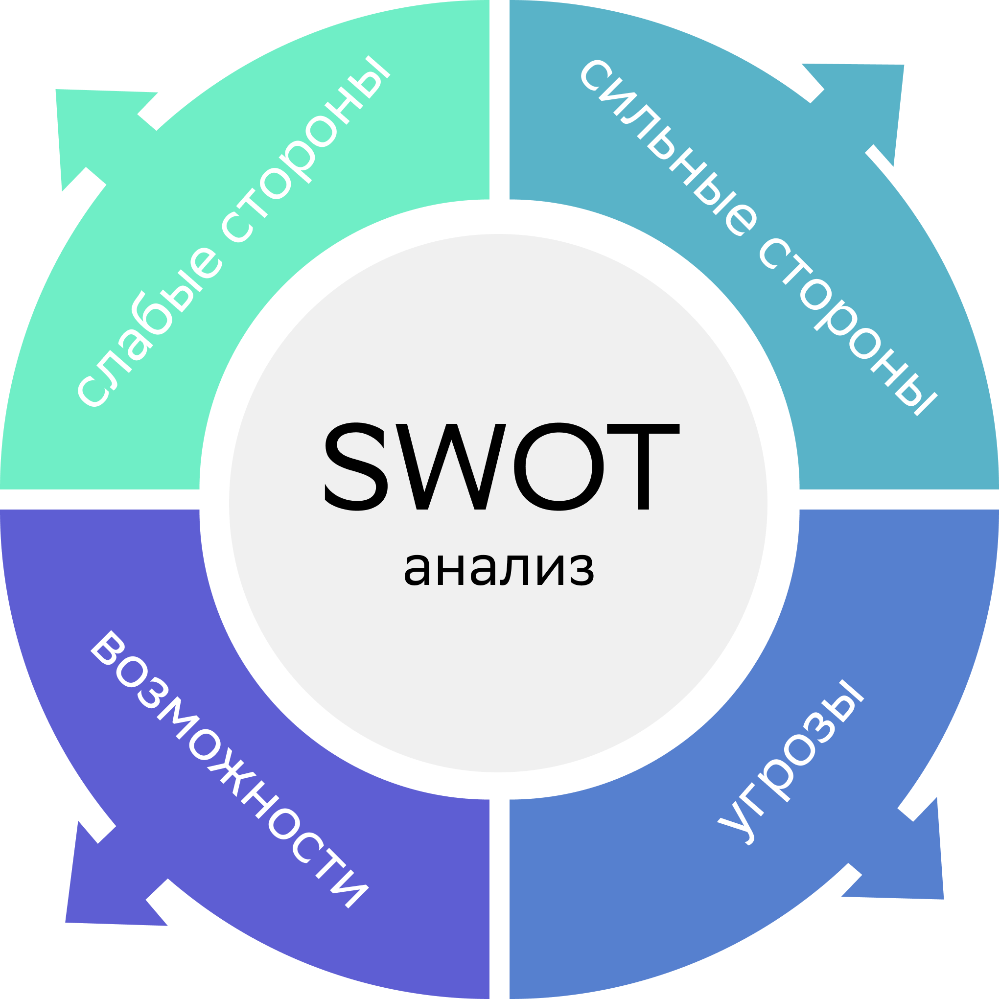

# Career track. Project 01
  
В данном проекте ты познакомишься с основными этапами поиска работы, анализом вакансий, где и как искать позиции, которые релевантны твоему опыту. 

## Contents

1. [Chapter I](#chapter-i) \
    1.1. [Preamble](#preamble)
2. [Chapter II](#chapter-ii) \
    2.1. [General rules](#general-rules)
3. [Chapter III](#chapter-iii) \
    3.1. Аналитика рынка. Где и как искать вакансии и программы стажировок?      
    3.2. Советы поиска вакансий через сайты агрегаторы вакансий и карьерные сайты компаний.     
    3.3. Анализ навыков: hard и soft skills. Как анализировать навыки для написания резюме.     
    3.4. Анализ требований к кандидатам.  
4. [Chapter IV](#chapter-iv) \
    [Задача](#задача)    
5. [Chapter V](#chapter-v) 

<h2 id="chapter-i" >Chapter I</h2>

  

<h2 id="preamble">Preamble</h2> 

Представленный проект закладывает прохождение ключевых этапов перед составлением резюме, в частности проведение аналитики: 
1. Анализ рынка вакансий и стажировок. Где и как искать программы стажировок?  
2. Анализ твоих навыков: hard и soft skills. Как анализировать твои навыки для составления резюме? 
3. Советы поиска вакансий через сайты агрегаторы вакансий и карьерные сайты компаний. 
4. Анализ откликов и отказов. Дневник поиска работы, который помогает анализировать отклики на вакансии, чтобы понять, что можно улучшить в стратегии поиска.   

В рамках проекта ты:   
- упакуешь знания, навыки и опыт для резюме;  
- выстроишь стратегию поиска работы-мечты;  
- выберешь актуальные вакансии, которые соответствуют твоим приоритетам и опыту.  

<h2 id="chapter-ii">Chapter II</h2> 
<h2 id="genеral-rules">Genеral rules</h2>  

1. Всю дорогу тебя будет сопровождать чувство неопределенности и острого дефицита информации - это нормально. Не забывай, что информация в репозитории и Google всегда с тобой, так же как пиры и Rocket.Chat. Общайся, ищи, опирайся на здравый смысл и не бойся ошибиться.  
2. Будь внимателен к источникам информации: проверяй, думай, анализируй, сравнивай.   
3. Будь внимателен к тексту задания, перечитывай по нескольку раз.   
4. Внимательно читай примеры. В них может быть что-то, что не указано в явном виде в самом задании.  
5. Могут встретиться несоответствия, когда что-то новое в условиях задачи или примере противоречит уже известному. Если встретилось такое — попробуй разобраться. Если не получилось — запиши вопрос в перечень открытых вопросов и найдешь ответ в процессе работы. Не оставляй открытые вопросы неразрешенными. 
6. Если задание кажется непонятным или невыполнимым — так только кажется. Попробуй его декомпозировать. Скорее всего, отдельные части станут понятными.
7. На пути тебе встретятся разные задания. Такие как, помеченые звездочкой (*) — подходят для более дотошных и пытливых. Эти задания с повышенной сложностью и не обязательны к выполнению, но если ты их сделаешь, то получишь дополнительный опыт и знания. 
8. Не пытайся обмануть систему и окружающих. Ведь, в первую очередь ты обманываешь себя.  
9. Есть вопрос? Спроси своего соседа справа, если это не помогло — соседа слева. 
10. Когда пользуешься чей-либо помощью, то всегда разбирайся до конца: почему, как и зачем. Иначе помощь не будет иметь смысла.
11. Всегда делай push только в ветку develop! Ветка master будет проигнорирована. Работай в директории src. 
12. В твоей директории не должно быть иных файлов, кроме тех, что обозначены в заданиях.  

<h2 id="chapter-iii">Chapter III</h2> 

## Аналитика рынка

_Где и как искать вакансии и программы стажировок?_. 
Анализ рынка вакансий - это ключ к поиску работы. Именно через анализ можно понять, на какие позиции ты подходишь, какие навыки у тебя уже есть, а какие необходимо подтянуть или приобрести. Аналитика вакансий поможет понять специфику той или иной должности, которая тебе нравится. 

_Как провести аналитику вакансий?_ 
Необходимо вбить в таблицу разные желаемые позиции и определить, какие требования и обязанности чаще всего встречаются. 
[Пример таблицы “Аналитики рынка”](./materials/Анализ_вакансий.xlsx). 

_Для чего нужно делать подобную аналитику?_  
1. Чтобы иметь четкое  представление о будущей профессии;    
2. Определить, каких навыков не хватает и что необходимо подтянуть;  
3. Определить, каким образом ты будешь нарабатывать опыт:  
- найти дополнительное обучение;   
- приобрести опыт на текущей работе;  
- найти ментора, который подскажет, какие еще могут быть действия или даст обратную связь;  
- найти стажировку.  
4. Иногда после хорошо проделанной  аналитики, человек понимает, что вообще не хочет заниматься этой деятельностью и начинает искать другие вакансии.  
5. Когда ты сделаешь аналитику рынка вакансий, у тебя сформируется полное представление о том, к чему ты стремишься. И уже дальше можно выстраивать конкретные шаги к цели.  

_Какие существуют ресурсы для поиска вакансий?_  
1. Основные сайты:  
- HeadHunter – ведущий и один из самых крупных сайтов по поиску работы;  
- [СберРабота](https://sber.rabota.ru/);  
- IT-ресурсы: Хабр Карьера, tproger, careerspace;  
- Если ты рассматриваешь работу за рубежом, то можно обратить внимание на Glassdor и профессиональную социальную сеть Linkedin (работает с VPN).  
2. Сайты со стажировками: Future Today, БудуJobs, icanchoose и др.   
3. Карьерные сайты компаний.  

Определись **с целью поиска: ты планируешь работать на российском рынке или зарубежном?** 
Для каждого варианта - свои методы поиска.  

Если представить кратко, любой поиск работы выглядит следующим образом: 
Составление резюме -> отклик на вакансию -> Приглашение на собеседование -> Отказ или Офер.  
Но в глобальном смысле поиск работы на разных рынках отличается.  

**Поиск работы на российском рынке:**
1. Зайти на сайт компании-мечты и найти раздел “вакансии” или “карьера у нас”, далее направить резюме и сопроводительное письмо.  
2. Сделать резюме на hh.ru. Также можно оставить отклик как на вакансию, так и на сайте карьеры.  
3. Если в описании вакансии есть контакты рекрутера, можно написать ему сопроводительное письмо, резюме на почту или в мессенджер (в рабочее время).  
4. Подписаться на рассылку вакансий.  
5. Принимать участие в [one day offer](https://developers.sber.ru/portal/events/onedayoffer-june)
   Подобные мероприятия проходят и в других крупных компаниях.  
6. Почти у каждой компании есть свой чат-бот с вакансиями в телеграм. Подпишитесь на вакансии и не упускай возможность подать заявку.  

**Если это международная компания** (даже, если офис находится в России), то лучше сделать резюме на английском (особенно, если вакансия тоже написана на английском):    
1. Используй для поиска работы профессиональную сеть Linkedin (работает с VPN), [советы по наполнению](https://habr.com/ru/post/464757/).   
2. Откликайся на сайтах компании в разделе “career”.   
3. Не забывай о дополнительных сайтах по поиску вакансий за рубежом: Glassdor.   
5. Подпишись на рассылку вакансий от компании и периодически мониторь.   

_Общие пожелания ко всем целям поиска работы: **Развивать нетворкинг**_
1. РандомКофе.
Необходимо выбрать сообщества по интересному для тебя направлению, заводить полезные знакомства, обменяться опытом. Встречи проходят раз в неделю, через телеграм-бот тебе попадается один человек для знакомства (можно выбирать онлайн или офлайн). Также раз в 2-3 месяца проходят большие нетворк-сессии на 20-25 человек.  
2. Принимать участие в профессиональных сообществах (например, proftalk, mesto.co) и хакатонах. Можно следить за [мероприятиями](https://it-events.com). 

Такие встречи тебе дадут новые возможности:   
- полезные контакты людей из разных компаний;   
- приглашение на работу;  
- обратную связь по твоему резюме или тестовому заданию; 
- расширенный поиск ментора для себя.

## Анализ ваших навыков: hard и soft skills 
### Как анализировать свои навыки для написания резюме 

Существуют разные методы для анализа твоих навыков. Один из самых популярных - это SWOT-анализ навыков. 

Таблицу можно разделить на 4 составляющие: 
Первые два пункта можно определить через анализ вакансий. 

1. Сильные стороны:  
К сильным точкам опоры можно отнести:  
- образование; 
- опыт работы; 
- навыки в желаемой сфере, результаты работы и тд. 
2. Слабые стороны - зона развития:  
К слабым сторонам относят:   
- недостаток информации и опыта;  
- неумение выстраивать отношения с руководством, коллективом и т.д.  
3. Ваши возможности:  
Наличие времени и мотивации для изучения новой информации. 
4. Риски или угрозы:  
- обстановка в мире;
- наличие препятствий или конкурентов.

Подробнее, как можно проводить [анализ навыков](https://www.youtube.com/watch?v=J8EcCQxAzjg&t=125s) 

## Анализ откликов и отказов

Дневник поиска работы помогает анализировать отклики на вакансии, чтобы понять, что можно улучшить в стратегии поиска работы.   
Очень важно анализировать отказы, чтобы при дальнейших действиях оперативно реагировать, вносить изменения и улучшать стратегию поиска работы.

1. Если ты заметил, что больше всего отказов на этапе “рассмотрения резюме”, значит необходимо переработать резюме - проверить должности, какие результаты написаны в опыте работы, твое портфолио.  

2. Если отказов больше после собеседования с HR-менеджером, значит нужно лучше готовиться к собеседованию: 
- лучше продумать рассказ о себе; 
- изучить самые частые [вопросы](https://hh.ru/article/303229); 
- быть готовым к техническим вопросам на [собеседовании](https://tproger.ru/articles/sobesedovanie-v-it-kompaniju-chto-nuzhno-znat-dzhunioru/).  

3. Если отказов больше после тех.собеседования/тестовых заданий, обратите внимание на твои hard-скиллы, что необходимо подтянуть.   
4. Можно также обратиться за обратной связью к [менторам](https://getmentor.dev) в своей области или найти человека, который уже работает на данной должности.  

[Пример дневника](./materials/Diary.xlsx) 

## Критерии выбора вакансии и компании 
### Как не ошибиться с выбором? 

Типичная ошибка кандидата - откликаться на все вакансии или во все компании подряд.
Так делать не нужно. Нерелевантные отклики не просматривают рекрутеры. 

_Помни про твою  цель и приоритеты, что ищешь._
Определи, на какие позиции, исходя из твоего опыта, ты можешь подойти.
Составь свой чек-лист выбора вакансии. Пример критериев:  
- Высокая зарплата;  
- Финансовая стабильность компании;   
- Карьерный рост;  
- Интересная работа;   
- Коллектив;  
- Баланс между работой и личной жизнью;  
- Хорошая репутация;   
- Внедрение высоких технологий;  
- Забота об окружающей среде;  
- Участие в волонтерской деятельности; 
- Социальный пакет;  
- Трудоустройство по ТК РФ и др.   

Как только ты напишешь свои критерии поиска, будет легче ориентироваться в огромном бассейне разных вакансий. 

## Анализ требований к кандидатам.  

_На что обращают внимание работодатели?_  
Требования к кандидатам можно разделить на 3 части:  
1. Анализ резюме кандидата.  
2. Анализ soft-skills кандидата.  
3. Анализ hard-skills кандидата.  

**1. Анализ резюме**  
У каждого рекрутера всегда есть некий описанный профиль личности кандидата на позицию, которую он ищет. 
Что может входить в этот профиль?   
- образование;  
- определенные навыки/стек технологий;  
- определенный опыт (например, обязателен опыт в стартапах или обязателен опыт в крупном бизнесе);  
- ожидаемый уровень заработной платы;  
- желаемый график работы;   
- наличие сопроводительного письма;  
- знание языков;  
- наличие портфолио и тд.  

Исходя из профиля кандидата, рекрутер старается максимально близко найти того, кто соответствует и пригласить на первичный этап собеседования. 

**2. Анализ soft-skills кандидата**  
Soft-скиллы определяется чаще всего в рамках интервью:  
Проверяются такие компетенции как:   
- коммуникативные навыки;
- управление собой;
- мышление (системное, креативное и т.д.);
- управленческие навыки;
- предпринимательские навыки и др. 

Проверка навыков зависит также от позиции и от профиля кандидата. 
Более подробно про интервью будет в DAY 03.

**3. Анализ hard-skills кандидата**  
Данный навык проверяется: 
- через тестовое задание;  
- через техническое собеседование.  

Человек не может все знать, но может стремиться постоянно улучшать свои знания и становиться экспертом в своей сфере. Поэтому не бойся ошибок, бери обратную связь у более опытных коллег, больше читай профессиональную литературу и решай тестовые задания, например тут: leetcode или тут codewars или тут: projecteuler.  

<h2 id="chapter-iv">Chapter IV</h2>  

## Задача 

Для решения задачи необходимо определиться с поиском работы: российский или зарубежный рынок.
В этом вопросе нет правильных или неправильных ответов. Ты можешь использовать любые помогающие инструменты, задавать больше уточняющих вопросов, записывать, рисовать майнд-мэпы и прийти к итоговой цели. По итогу у тебя должно получится 1-2 вакансии, под которые ты будешь готовить свое резюме.

<h2 id="chapter-v">Chapter V</h2>  

## Exercise 00 
### Выбор компании 

1. Составить свой чек-лист выбора компании (загляни обязательно в DAY 00 в упражнение карьерное колесо, чтобы все желаемые критерии были соблюдены максимально, насколько это возможно, и занеси этот список в Трелло (1 доска). (От 10 критериев). 
2. Составить список компаний в трелло (2 доска), где хочется поработать (минимум от 5 компаний).  
3. На третьей доске в трелло выписать ссылки на вакансии из этих компаний,если имеются(от 3 вакансий). 
4. Подписаться на карьерные рассылки 1-2 компании.   

## Exercise 01
### Анализ вакансий

1. Создать таблицу "Анализ вакансий" (желательно в Google-таблицах).   
2. Найти не менее 7 вакансий и занесите их в таблицу.  
3. Проанализировать 7 желаемых вакансий, необходимо выписать все требования и обязанности из вакансий в таблицу. 
5. Исходя из требований и обязанностей, которые выписал — определить, какими владеешь, а какими нет.
6. Требования и обязанности, которыми ты не владеешь, необходимо понять, как сможешь их достичь.
Например, обучение, наставник, опыт на текущем месте, стажировка, фриланс-проект?
8. Вернуться в таблицу карьерных целей и на основании аналитики требований и обязанностей, прописать шаги по достижению целей через 2-3 года. 

## Exercise 02
### Анализ навыков

1. Нарисовать в MIRO таблицу SWOT-анализа. 
2. Для каждой графы ответь на вопросы и запиши в таблицу: 
2.1. Сильные стороны (Strengths): 
- Какие свойства выделяют вас на фоне остальных? Это могут быть любые навыки, образование, связи; 
- Какие ресурсы имеются в наличии и какие могут быть получены при надобности? 
- Какое качество является твоей сильной стороной по мнению окружающих? 
- Какими достижениями ты можешь похвастаться на данный момент?

2.2. Слабые стороны (Weaknesses): 
- Какие задачи тебе некомфортно выполнять?
- Какие твои качества считают слабым местом окружающие? 
- Есть ли у тебя негативные привычки, касающиеся работы? (опоздания, вспыльчивость, отсутствие стрессоустойчивости и т.д.);
- Есть ли у тебя особенности характера, блокирующие движение к цели? 

2.3. Возможности (Opportunities):
- В каком состоянии сейчас пребывает сфера твоей деятельности? Какое преимущество это представляет для тебя? 
- Какие инновационные технологии ускорят достижение цели?
- Какие изменения и закономерности наблюдаются в индустрии и стране в целом? Как это сможет помочь тебе? 
- Какие ошибки ты можешь выделить из неудачного опыта других людей, работающих в этой сфере?

2.4. Угрозы (Threats):
- С какими трудностями ты сталкиваешься при выполнении рабочих обязанностей? 
- Есть ли у тебя прямые конкуренты? (например, за повышение); 
- Могут ли твои слабые стороны застопорить движение к цели?

>Пожалуйста, оставь обратную связь по проекту в [форме обратной связи.](https://forms.gle/uiPQx2gWiZAVuphk7) 

