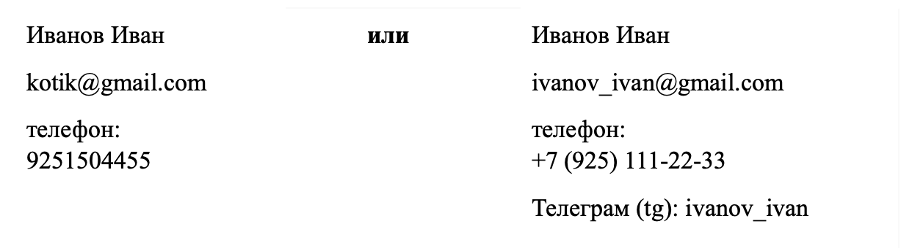

# Career track. Project 02

В данном проекте ты упакуешь собственное резюме в соответствии с основными правилами для выбранной вакансии или стажировки, правильно опишешь навыки, опыт и финансовые ожидания, а также составишь сопроводительное письмо, учитывая собственные пожелания и ожидания от вакансии.

## Contents

1. [Chapter I](#chapter-i) \
    1.1. [Preamble](#preamble)
2. [Chapter II](#chapter-ii) \
    2.1. [General rules](#general-rules)
3. [Chapter III](#chapter-iii) \
    3.1. Должность и контактная информация    
    3.2. Навыки  
    3.3. Опыт    
    3.4. Где сделать резюме?  
    3.5. Типичные ошибки в резюме    
    3.6. Сопроводительное письмо  
    3.7. Как говорить о зарплате?  
4. [Chapter IV](#chapter-iv) \
    [Задача ](#задача)    
5. [Chapter V](#chapter-v) 

<h2 id="chapter-i" >Chapter I</h2>

  

<h2 id="preamble">Preamble</h2> 

Резюме — это визитная карточка, которая презентует тебя, твои навыки и опыт.  
Помни, что резюме ты пишишь не для себя, а для работодателя. Представь, что ты работодатель и читаешь свое резюме. Перед тем как отправить отклик, подумай ты бы хотели пригласить такого кандидата на собеседование?   

Резюме состоит из определенных разделов: 
1. Должность и контактная информацияи;  
2. Упаковка опыта;  
3. Описание навыков;  
4. Раздел о себе;  
5. Другая информация, которую необходимо указать.  

В этом проекте ты научишься:  
- составлять актуальное резюме и использовать его в дальнейшем;  
- писать сопроводительное письмо;  
- определять финансовые ожидания.   

**Литература:** 
1. [Карьерные советы по резюме и примеры резюме по вакансиям](https://icanchoose.ru/blog/cid/2/)
2. [Блог по резюме](https://myresume.ru/blog/)
3. [Что писать в резюме, чтобы получить работу мечты: советы от HR для сферы IT](https://habr.com/ru/company/getmatch/blog/655463/)
4. [Идеальное резюме для разработчика](https://habr.com/ru/post/542372/)

<h2 id="chapter-ii">Chapter II</h2> 
<h2 id="genеral-rules">Genеral rules</h2>  

1. Всю дорогу тебя будет сопровождать чувство неопределенности и острого дефицита информации - это нормально. Не забывай, что информация в репозитории и Google всегда с тобой, так же как пиры и Rocket.Chat. Общайся, ищи, опирайся на здравый смысл и не бойся ошибиться.  
2. Будь внимателен к источникам информации: проверяй, думай, анализируй, сравнивай.   
3. Будь внимателен к тексту задания, перечитывай по нескольку раз.   
4. Внимательно читай примеры. В них может быть что-то, что не указано в явном виде в самом задании.  
5. Могут встретиться несоответствия, когда что-то новое в условиях задачи или примере противоречит уже известному. Если встретилось такое — попробуй разобраться. Если не получилось — запиши вопрос в перечень открытых вопросов и найдешь ответ в процессе работы. Не оставляй открытые вопросы неразрешенными.   
6. Если задание кажется непонятным или невыполнимым — так только кажется. Попробуй его декомпозировать. Скорее всего, отдельные части станут понятными. 
7. На пути тебе встретятся разные задания. Такие как, помеченные звездочкой (*) — подходят для более дотошных и пытливых. Эти задания с повышенной сложностью и не обязательны к выполнению, но если ты их сделаешь, то получишь дополнительный опыт и знания.  
8. Не пытайся обмануть систему и окружающих. Ведь, в первую очередь ты обманываешь себя.  
9. Есть вопрос? Спроси своего соседа справа, если это не помогло — соседа слева.  
10. Когда пользуешься чей-либо помощью, то всегда разбирайся до конца: почему, как и зачем. Иначе помощь не будет иметь смысла.  
11. Всегда делай push только в ветку develop! Ветка master будет проигнорирована. Работай в директории src.  
12. В твоей директории не должно быть иных файлов, кроме тех, что обозначены в заданиях. 

<h2 id="chapter-iii">Chapter III</h2> 

## Должность и контактная информация

Контактная информация - эта первая информация, с которой знакомится рекрутер. Казалось бы какие там могут ошибки? Однако давайте сравним два оформления:
  

Как тебе кажется, какие контакты выглядят более профессионально?

Основные советы по оформлению этого блока: 
1. **Указывай Фамилию и Имя**  
Отчество в диджитал-среде не обязательно указывать, исключение может быть только, если ты планируешь в госсектор/банки.

2. **Почта! Никаких kotletka@, princesska@, kotik@**  
Давай оставим эти почты для спам-магазинов. 
Как лучше указать фамилия_имя@... 
Например, malikova_julia, malikovaj и тд. 

3. **Телефон** должен быть рабочим и, желательно, единственным на который можно дозвониться. 

4. **Укажи свой никнейм в телеграм** (только не kotik желательно).  
Сейчас многие рекрутеры используют телеграм для первичного общения с кандидатом, что очень удобно. Там также можно договориться о дате собеседования.  

5. **Вставь ссылку на портфолио (по желанию).**

## Навыки  
Навыки описываются в резюме, исходя из желаемой должности!
Как определить, какие навыки писать?  

**Необходимо вернуться к таблице с аналитикой твоих вакансий.**  
Посмотреть еще раз вакансии, которые тебе нравятся и которые выбрал. Далее выписать самые часто встречающиеся навыки в описании и соотнести со твоим  опытом.  

Существует большое количество [примеров](https://myresume.ru/examples/it-specialist/).  
Выписывай навыки, исходя из твоего уровня знаний и опыта в порядке приоритетности. 
И, конечно, не преувеличивай свои навыки, если ты не работал с каким-либо компонентом или просто отсутствует опыт, то лучше и не указывать. 

## Упаковка опыта   
Основные правила:  
1. Опыт работы в резюме всегда указывается с последнего места к первому.  
2. В опыте работы всегда должны присутствовать твои задачи и результаты. Любому потенциальному работодателю интересно посмотреть на твои  достижения.   
Главный ответ, который хочет получить работодатель, глядя на твое резюме: “Чем ты был полезен прошлому работодателю?”  
3. Вернись к анализу вакансий, посмотри, какие требования и обязанности указаны в вакансиях. Это твоя главная подсказка при написании резюме.

Что важно указать в опыте работы?
1. Название компании; 
2. Период (года) работы; 
3. Должность; 
4. Задачи; 
5. Результаты.   

**1. Название компании**  
Если ты работал в крупной компании, то скорее всего любой нанимающий hr-менеджер знает эти компании и такое резюме придает вес к опыту.  
Если ты работал в малоизвестной фирме, то желательно написать, что выделяет эту компанию, какая сфера деятельности компании. Обычно эту информацию можно найти на сайте самой компании. Возможно, компания лидер в какой-либо индустрии, работает с крупными клиентами (Сбер, Яндекс и т.д). Все это можно указать в резюме.  

**2. Период (года) работы**  

- Указывай только месяцы и года. Не нужно писать точные даты приема и увольнения. Не нужно указывать в резюме в каждом опыте работы сколько месяцев ты  отработал в компаниях.  
_Например:_ март 2018 - апрель 2020  
Если ты работаешь на момент поиска работы, то можно указать так:
март 2018 - по наст.время  

- Всегда указывай опыт работы с последнего (текущего места) к первому твоему опыту.
Если у тебя рваный опыт работы: по 3-4 месяца на каждом месте работы. Можно объединить в проектную деятельность/фриланс.   

-  Можно не указывать какие-то места и на собеседовании сказать, что были в поиске работы и проходили собеседования. Стандартный поиск работы может занимать от 3 до 6 месяцев - это нормально.
Стараться в дальнейшем задерживаться на работе на год-полтора. 
Потому что те, кто часто меняют место работы, для рекрутера расцениваются как непостоянные или ненадежные люди. 

**3. Должность**   
Указывай ту должность, которую ты занимал. Желательно, чтобы твоя должность и желаемая позиция были одинаковыми. 

**4. Задачи**  
Вопросы в помощь для описания прошлого опыта:
1. Какую пользу я приносил компании?  
2. Как моя работа влияет на цели компании/отдела?  
3. Как мою работу можно оцифровать?  
4. Какие показатели улучшились за время моей работы?  
5. Какие мои сильные компетенции?
_Чтобы ответить на этот вопрос посмотри задание SWOT-анализ_
6. Сэкономил ли ты какие-либо ресурсы в компании? 
7. Что ты умеешь делать лучше всех в твоей работе?  
8. Повлиял ли ты на какие-либо процессы отдела/компании, что принесло улучшение?  

Важно написать именно то, что ты делал, какие задачи перед тобой стояли. И не рекомендуется прописывать должностные инструкции, их никто не читает. 

_Пример должностной инструкции: _
_Должностные обязанности._
Аналитик выполняет следующие должностные обязанности:  
1. Организует аналитическое обеспечение научно-методических работ в ходе реализации программы опытно-экспериментальной работы.  
2. Взаимодействует с заместителем директора по научно-методической работы и методистом.  
3. Проводит аналитическую работу с целью сбора, оценки и анализа получаемой информации.    
4. Участвует в организации и проведении научно-практических конференций, семинаров, круглых столов и других форм распространения опыта по теме реализуемого проекта опытно-экспериментальной работы.  
5. Оказывает консультативную и практическую помощь сотрудникам учреждения по направлениям опытно-экспериментальной работы в рамках его компетенции.  

В резюме же ты пишешь результат своей деятельности в работе, например:
1. Разработал инструмент для анализа качества данных, использовал ML и статические методы. Инструмент позволил заказчику сэкономить до 60 чел/часов в месяц.  
2. Переработал модель классификации текстов бухгалтерской отчетности. Новая модель работает на 15% быстрее и на 6% лучше по метрике f1.  

**5. Результаты**  
Этот пункт самый важный в резюме. Компании-работодателю всегда интересны, какие результаты ты сделал, поэтому желательно результаты оцифровать.
Глаголы, которые помогут вам описать ваши достижения:
- улучшил 
- сократил 
- оптимизировал 
- разработал и др.  

**Опыт работы без опыта. Что писать?**   
Самый частый вопрос: "Что писать в резюме, если нет опыта?"  
1. Стажировки или практики от “Школы 21”.
2. Фриланс-проекты, которые можно и нужно занести в портфолио. 
3. Учебные проекты, которые ты выполнял в рамках обучения “Школы 21” также можно заносить как твой опыт. 
4. Участие в интеллектуальном волонтерском проекте или IT-помощь для волонтеров. 
Где ты можешь подать заявку на проект,  и при успешном отборе выполнить задание и занести его в портфолио. (ProCharity).  
5. Профессинальные проекты. Программистам можно участвовать в  [Open Source проектах](https://tproger.ru/articles/open-source-for-beginners/).   
6. Опыт участия в кейс-чемпионатах и хакатонах.  

## Раздел о себе  
Что писать в разделе о себе?   
1. **О твоих сильных сторонах на желаемую должность.**   
Даже при отсутствии релевантного опыта можно найти сильные стороны из прошлого опыта. Чаще всего это относится к так называемым “софт скиллам”. Всегда апеллируй твоим прошлым опытом, почему ты считаешь тот или иной навык твоей сильной стороной. Посмотри в прошлом проекте задание 2, где ты делал анализ твоих сторон.  

2. О твоем желании и целях развиваться в новой области. Почему ты хочешь развиваться, что привело тебя в эту сферу. Сюда также можно добавить ссылку на портфолио/сайт/профессиональный блог.

_Совет №1:_  
1. В разделе можно указать твою цель. Напиши, почему ты любишь свою работу, что тебя вдохновляет?  
2. Укажи твои качества, которые не имеют отношения к профессии, например, твои спортивные достижения.  
3. Укажи твои мягкие навыки (софт скиллы).  
Только не пиши через запятую: стрессоустойчивый, проактивный, коммуникабельный и т.д.
Когда указываешь подобные навыки, возвращайтесь к своему прошлому опыту. Задай себе вопрос, почему у тебя лидерские качества? Возможно у тебя был опыт в студенческие годы ведения проектов, за которые ты нес ответственность? Если ты стрессоустойчив? Почему? Какая ситуация/работа способствовала развитию такого навыка?
  

## Где сделать резюме?  
1. Сформировать резюме на hh.ru.  
2. Использовать конструкторы резюме, например: BuduJobs, Icanchoose, Grintern, Novoresume, MyResume.ru. 
3. Использовать готовые шаблоны в Canva.  
4. Оформить резюме в Word (и сохранить в формате PDF).  
5. Создать резюме в Word и сохранить на Google диске и отправлять ссылку на свое резюме.  
(Не забудьте открыть доступ)  
7. Создать резюме в Notion.

_Совет №1 "Сделайте два резюме: одно на HH.ru, а второе в любом конструкторе"_  
HH.ru является стартовой площадкой в поиске работы, а для других карьерных сайтов или при поиске работы в телеграм каналах можно использовать другое резюме.  

_Совет №2. "Не более 2-ух страниц, а лучше одна"_   
Стандарт резюме 2 страницы, желательно основную информацию разместить на первой странице. 
Но запомни, не важно сколько у тебя страниц в резюме, главное, чтобы твое резюме было интересно читать. 

## Типичные ошибки в резюме  
| Ошибка | Как исправить |
| ------ | ------ |
| 1. Отсутствие достижений в твоем опыте работы | Расписать не только твои обязанности, но и указать твои KPI.Например:  - вошел в ТОП-3 лучших студентов курса; - являлся наставником для 5+ сокурсников, оказывал помощь в освоении программы обучения - выполнил 30+ учебных проектов. KPI – это измеримые показатели твоей  работы. Эти данные показывают твою  эффективность, и то, что интересно работодателю. |
| 2. Указан неверный уровень владения иностранным языком | Будь честен, указывай тот, который у тебя  есть на данный момент. Начальный уровень (Beginner); Элементарный уровень (Elementary); Ниже среднего (Pre-Intermediate); Средний (Intermediate); Выше среднего (Upper Intermediate);  Продвинутый (Advanced); Супер продвинутый (Mastery). |
| 3. Орфографические ошибки в резюме | Попроси проверить резюме друга, преподавателя или на [сайте](https://glvrd.ru/) |
| 4. Некорректные зарплатные ожидания | Изучи рынок зарплат в твоей отрасли и в твоем регионе |
| 5. Указание непрофильного опыта | Убери его из резюме, который не соответствует желаемой должности |
| 6. Слишком длинное резюме (на 3 и более страницы) | Убери лишнее, резюме должно быть информативным и лаконичным. Максимум 2 страницы. |

## Сопроводительное письмо 
Зачем и в каких случаях нужно сопроводительное письмо?   
1. Сопроводительное нужно, когда его просят написать в самой вакансии.   
Если этот пункт там есть, то лучше не пренебрегать и выполнить условия вакансии.  
2. Если ты меняешь сферу, то в сопроводительном письме обязательно нужно написать о твоей новой мотивации.  
3. Если ты молодой специалист и только начинаешь свою карьеру.   
4. Если в самой компании нет вакансии, но ты очень туда хочешь.

В сопроводительном письмо тебе необходимо глобально ответить на два вопроса:  
1. Зачем вы нужны компании?  
2. Зачем компания нужна вам?  

Ответьте себе на вопрос “Что вас цепляет? Почему ты действительно хочешь там работать?”  
Покажи свою мотивацию.  

**Шаг 1.** 
Проведи анализ компании/вакансии/проекта. 
- задачи на желаемой позиции (проблемы, приоритеты);   
- требования к кандидату;  
- миссия компании; 
- ценности; 
- качества, которые ценит та или иная компания. 

**Шаг 2.**
Ответь на вопросы:
- Что мне известно про компанию?  
- Что меня мотивирует в этой позиции?  
- Насколько эта позиция является логичным продолжением карьеры?  
- Что я могу сделать для решения той или иной проблемы?  
- Какими навыками, знаниями, достижениями я обладаю, чтобы соответствовать данной позиции?  

**Шаг 3.**
Составь сопроводительное письмо, используя структуру:  
1. Краткое приветствие (Если знаешь имя HR-менеджера, то можно поприветствовать в письме).  
2. Расскажи, на какую должность ты претендуешь, если отправляешь резюме на рабочую почту работодателя. Лучше указывать, где именно ты увидел вакансию.  
3. Интерес к вакансии/компании/проекту (Ответ на вопрос: Почему компания тебе интересна?).       
4. Сильные стороны, исходя из желаемой должности (Ответ на вопрос: Почему этой компании ты можешь быть интересен?).   
5. Снова напомните о вашей мотивации. К примеру: с радостью приму участие в конкурсе на вакансию.   
6. Укажите ваши контактные данные.  

Пример [Сопроводительного письма](materials/Сопроводительное_письмо.pdf).  

## Как говорить о зарплате?  
Старайся быть в теме рынка аналитики зарплат. Ты всегда можешь посмотреть свой файл по аналитике вакансий.  
В открытых источниках много информации о средней “вилке” специалистов. 

Полезные ресурсы для аналитики зарплат:   
1. Зарплатомер;
2. Обзор зарплат;
3. Труд;
4. Кадровые агентства, которые проводят аналитику зарплат. 

Для ведения переговоров о зарплате, как на стадии трудоустройства, так и при разговоре о повышении, важно понимать, сколько ваш труд стоит на рынке:   
- Подготовься к вопросу «Почему/за что работодатель должен повышать зарплату? Тут важно, что ты показываешь результаты и твой труд в компании  приносит пользу/деньги. Тогда подготовьте небольшой отчет о проделанной работе. Что вы делали/Что сделали? Как было/Как стало? Что улучшилось благодаря вашей работе/Какие показатели стали больше/меньше за счет чего/каких ресурсов? 
- Посмотри самостоятельно аналитику вакансий. Ты сделал аналитику вакансий в прошлом проекте. Это тоже твоя подсказка для переговоров о зарплате.  
Если большинство навыков соответствуют желаемым позициям, это хороший повод поговорить с руководителем о повышении.

<h2 id="chapter-iv">Chapter IV</h2>  

## Задача  

Тебе необходимо сделать собственное резюме для вакансии, которую ты отобрал в предыдущем проекте.
После того, как ты сделаешь резюме, необходимо найти человека на такой же должности, на которую претендуешь или среди выпускников “Школы 21”, и получить обратную связь по резюме.  

Желательно оценить каждый блок резюме:  
1. Контакты и желаемая должность. 
2. Опыт работы. 
3. Навыки. 
4. Соответствуешь ли ты конкретной должности. 

<h2 id="chapter-v">Chapter V</h2>  

## Exercise 00 
### Твое резюме
Алгоритм действий:
1. Зарегистрироваться на сайте hh.ru.  
2. Найти желаемую вакансию, которая подходит по твоим навыкам и опыту из Project 01.  
3. Создать резюме для твоей желаемой должности.  
4. Заполнить раздел контактной информации.  
5. Заполнить раздел “опыт работы”.  
6. Указать необходимые навыки, которые соответствует конкретной должности.  
7. Опубликовать резюме.  
8. Прикрепить готовое резюме в папку src.   

## Exercise 01
### Проверка резюме
Алгоритм действий:
1. Найти человека, который работает на текущей позиции или управляет такой командой.  
2. Попросить дать обратную связь по резюме (желательно в формате переписки).  
3. Прикрепить обратную связь.  
4. Написать, что ты изменил после обратной связи. 

_*Тебе пригодится сообщество “Школы 21”._

## Exercise 02
### Сопроводительное письмо 
Алгоритм действий:
1. Напиши к выбранной вакансии сопроводительное письмо.  
2. Ответь на два главных вопроса в сопроводительном письме:  
   - Зачем ты нужен компании?   
   - Зачем компания нужна тебе?   

>Пожалуйста, оставь обратную связь по проекту в [форме обратной связи.](https://forms.gle/EswurHPem46cnxCZA)
